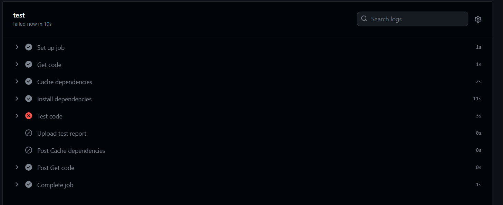

i want to run `Upload test report` step when `Test code` step fail

- name: Test code
  run: npm run test - name: Upload test report
  uses: actions/upload-artifact@v3
  with:
  name: test-report
  path: test.json

here test job fail still `test-report` not running because github has default behaviour if one step fail all subsequent step will be skipped
so for that we need to define on Status check functions
